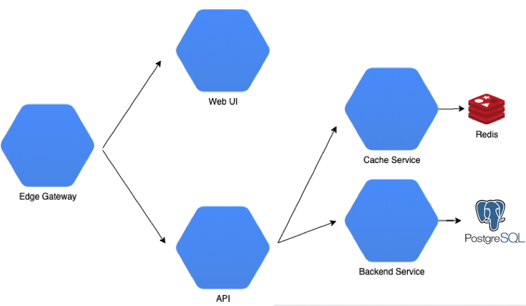

# Howdy and Welcome

What is this?  

Simply put its a uService app build in [Spring Boot](http://spring.io/projects/spring-boot) using the Todo as a domain model. The **"Todo"** is well understood which makes it useful for reasoning about and comparing frameworks.  For example [**TodoMvc**](http://todomvc.com) is a resource developers can use to evaluate frontend frameworks against a concise and consistent model.

## Playground

### [__todos-edge__](/todos-edge)

Todo(s) Edge is an edge for other Todo apps and serves as a client entry-point into functionality.

---

### [__todos-webui__](/todos-webui)

A sample frontend [Vue.js](https://vuejs.org/) app wrapped in [Spring Boot](https://spring.io/projects/spring-boot) goodness.

---

### [__todos-api__](/todos-api)

A sample [Spring Boot](https://spring.io/projects/spring-boot) service that uses spring-boot-starter-web to implement a Spring MVC based REST API for Todo(s)

---

### [__todos-redis__](/todos-redis)

A sample [Spring Boot](https://spring.io/projects/spring-boot) service that uses JPA and Spring Data Redis to cache data.

---

### [__todos-postgres__](/todos-postgres)

A sample [Spring Boot](https://spring.io/projects/spring-boot) service that that provides data persistence in a postgres DB using JPA.

---